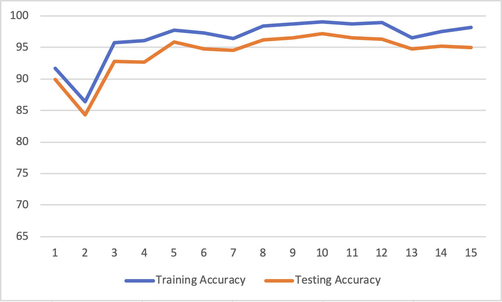

# Multi-Language-Classifier

Requires Java 9+

The goal of this is to combine a lot of the various techniques in machine learning, 
some of which I have learned in detail in my classes, and some of these have just been touched upon.

The techniques I'm going to explore:
  - genetic algorithms, used in feature selection
  - decision trees (detailed in class), a basic method of determining, but works for multiple output values
  - boosting, specifically adaboost (detailed in class), a method of weighting other learning algorithms and inputs to learn better
  - neural networks (parts are detailed, parts are not)
  
Feature selection:
  - specific words (the, a, an, and their equivalents)
    - mutation: pick a new word, given the entire list of words, with the proportional probability to the word count
    - crossover: blends don't make sense, so just return one of the parents
  - a word ends with a sequence of characters
    - mutation: add/remove a random character, drawn from the distribution of letters
    - crossover: all sub-sequences from the two suffixes blended
  - a word starts with a sequence of characters
    - mutation & crossover is similar to word endings
  - a word contains a sequence of characters
    - mutation & crossover is similar to word endings and starts
  - letter count of one letter greater than another letter
    - mutation: one letter changes according to the distribution of letters
    - crossover: the 4 combinations of two letter combinations
  
Multiple classification:
  - since there's many languages to decide between, I'm going to use binary classifiers in a one vs one approach.
  - requires training `K (K − 1) / 2` binary classifiers, and then taking the number of +1 votes on each classification, the one with the max is the language decided.

What to learn:
  - figure out which language a phrase is, learning from examples from wikipedia's random page links.
  
The languages I'm going to try to classify:
  - Albanian
  - Croatian
  - Czech
  - Danish
  - Dutch
  - English
  - French
  - Gaelic (Scottish)
  - German
  - Hawaiian
  - Icelandic
  - Italian
  - Romanian
  - Samoan
  - Spanish
  
These languages are strategically chosen:
  - They all have latin characters
     - Distinguishing between languages with different character sets is trivial
  - All have wikipedia pages with "Random Article" links, which I can scrape for examples
     - I really only know English and a very small amount of Spanish.

Given a phrase in one of the languages below, the program can detect and correctly classify the language, using machine learning techniques on training data.

## Tasks left to implement

  - Neural network learning
    - using linear combinations at each node (result = a + bx + cy + dz + ..., where a-... are learned weights)
    - customize the amount of hidden layers (0+) and the number of nodes per hidden layer
    - might decide to do a different way of the multi-classification

## Results - Decision Tree

The above graph shows the Decision Tree accuracy vs depth.

Parameters used: examplesFile=training.txt testingFile=testing.txt numberGenerations=75 poolSize=20,
with varying tree depth (1-10).

The above shows that the testing accuracy peaks at 95.9%.

Overfitting starts to play a part once the depth of the trees exceeds 6.

Each iteration of the training took around 12 seconds on my 4 core computer.

## Result - Adaptive Boosting

The above graph shows the Adaptive Boosting accuracy vs ensemble size.

Parameters used: examplesFile=training.txt testingFile=testing.txt numberGenerations=75 poolSize=20,
with varying ensemble size (1-15).

The above shows that the testing accuracy peaks at 97.2%, with 10 decision stumps in the ensemble.

Each iteration of training took around 14 seconds, with the time only slightly increasing
with larger ensemble sizes. The attribute learning took much of the time.

## Building the JAR

Install:
* Gradle
* Java 17+

`gradle shadowJar` to build the code into a jar suitable for upload to AWS lambda

`gradle bootJar` to build the code into a jar suitable for running as `java -jar NAME`

This project uses Spring Boot, Netflix DGS (for GraphQL).

## Running