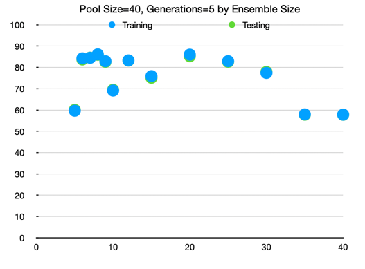
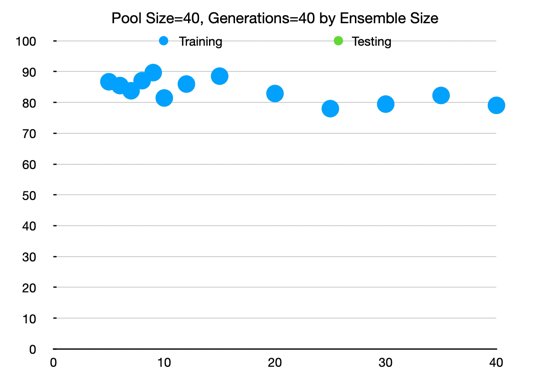
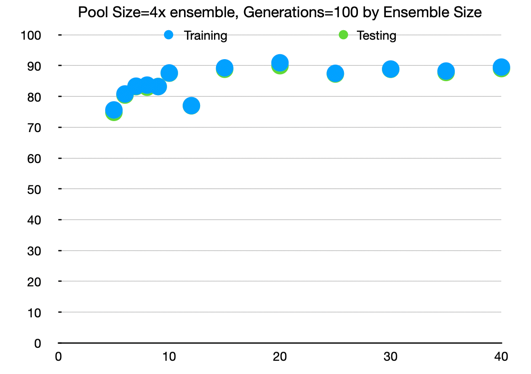

# Multi-Language-Classifier

This project trains an ML model on which language a sentence is based on the input date (located in /src/main/resources/data/odyssey*.txt).

Detects the following:
* English
* French
* German
* Spanish
* Swedish

These languages were chosen because they all share the Latin/Roman character set,
so there is some skill involved in knowing what language the sentence is.

"The Odyssey" was chosen as input data as it is in the public domain and it a fairly large text. 

## Setup
This project is the backend for a language classification API, and related API's.

This is written using:
* Kotlin (for the JVM)
  * requires Java 17+
* Spring Boot
* Netflix DGS (GraphQL framework for Spring)

To use in an IDE, import using gradle and set it to use java 17+

## Background: Artificial Intelligence / Machine Learning

I've learned some techniques in college but did not go very in depth. This project showcases a lot more depth.

* Data refining and pre-processing
  * I downloaded 5 different language translations of *The Odyssey* by Homer from the internet.
  * Many regex operations were used to get them into paragraph form.
* I am familiar with machine learning techniques:
  * genetic algorithms -- I use this to determine what "features" distinguish two languages
  * decision trees -- a simple way to have an algorithm "learn" how to use these features to distinguish two langauges
  * boosting techniques -- I use adaboost to improve the accuracy and reduce "overfitting" of the training data 
* I have extensive backend & cloud expertise
  * you can demo this on https://www.zach-jones.com/ - under the "Language Classifier" section
  * built using AWS and the technologies listed in the setup.

### Feature selection:
  - specific words (the, a, an, and their equivalents)
    - mutation: pick a new word, given the entire list of words, with the proportional probability to the word count
    - crossover: blends don't make sense, so just return one of the parents
  - a word ends with a sequence of characters
    - mutation: add/remove a random character, drawn from the distribution of letters
    - crossover: all sub-sequences from the two suffixes blended
  - a word starts with a sequence of characters
    - mutation & crossover is similar to word endings
  - a word contains a sequence of characters
    - mutation & crossover is similar to word endings and starts
  - letter count of one letter greater than another letter
    - mutation: one letter changes according to the distribution of letters
    - crossover: the 4 combinations of two letter combinations
  
### Multiple classification:
  - since there's many languages to decide between, I'm going to use binary classifiers in a one vs one approach.
  - requires training `K (K − 1) / 2` binary classifiers, and then taking the number of +1 votes on each classification, the one with the max is the language decided.

## Results

All of these results are based on a series of models trained based on:
* Training data ID: 1cd98469-5366-48c9-b837-438ca8ba042c
* Testing data ID: 35f4fd52-959d-4828-86d6-2193d4e22844
* Computer resources: Apple Macbook Pro 2021 w/ M1 Max

Note: training is run using multithreading, and will use up to the number of languages cores (5).

### Decision Trees

### Adaptive Boosting

#### Iterating on the pool + generation size

| Attribute Pool Size | Attribute Generations | Ensemble Size | Time (s) | Training Accuracy | Testing Accuracy |
|---------------------|-----------------------|---------------|----------|-------------------|------------------|
| 40                  | 5                     | 5             | 1.26     | 59.63             | 60.02            |
| 40                  | 5                     | 6             | 1.07     | 84.23             | 83.7             |
| 40                  | 5                     | 7             | 1.17     | 84.49             | 84.56            |
| 40                  | 5                     | 8             | 1.29     | 86.11             | 85.90            |
| 40                  | 5                     | 9             | 1.29     | 82.89             | 82.59            |
| 40                  | 5                     | 10            | 1.34     | 69.12             | 69.46            |
| 40                  | 5                     | 12            | 1.55     | 83.27             | 83.21            |
| 40                  | 5                     | 15            | 1.73     | 75.88             | 75.12            |
| 40                  | 5                     | 20            | 2.06     | 85.99             | 85.24            | 
| 40                  | 5                     | 25            | 2.29     | 82.92             | 82.61            |
| 40                  | 5                     | 30            | 2.94     | 77.40             | 77.86            |
| 40                  | 5                     | 35            | 3.21     | 57.92             | 57.78            |
| 40                  | 5                     | 40            | 3.14     | 57.81             | 57.76            |

With small attribute generations, the optimal ensemble size is around 20, or around 1/2 the attributes.

Repeating the same with Attribute Generations=40

| Attribute Pool Size | Attribute Generations | Ensemble Size | Time (s) | Training Accuracy | Testing Accuracy |
|---------------------|-----------------------|---------------|----------|-------------------|------------------|
| 40                  | 40                    | 5             | 1.82     | 86.72             | 87.3             |
| 40                  | 40                    | 6             | 1.95     | 85.48             | 85.76            |
| 40                  | 40                    | 7             | 2.03     | 83.80             | 83.85            | 
| 40                  | 40                    | 8             | 2.14     | 87.08             | 87.36            |
| 40                  | 40                    | 9             | 2.22     | 89.69             | 89.74            |
| 40                  | 40                    | 10            | 2.32     | 81.46             | 81.45            |
| 40                  | 40                    | 12            | 2.48     | 85.98             | 85.55            |
| 40                  | 40                    | 15            | 2.66     | 88.54             | 88.04            |
| 40                  | 40                    | 20            | 3.10     | 82.90             | 82.30            |
| 40                  | 40                    | 25            | 3.58     | 78.00             | 77.94            |
| 40                  | 40                    | 30            | 3.99     | 79.47             | 78.69            |
| 40                  | 40                    | 35            | 4.42     | 82.27             | 81.98            |
| 40                  | 40                    | 40            | 4.73     | 79.07             | 78.97            |

With the same y-axis, we can see that larger number of generations will yield more consistent results.

The training did take a few seconds longer, but overall it was still super fast (< 5 seconds).

From this the best accuracy happens when the ensemble size is around 1/4 the pool size of 40.

Let's set that ratio, and see what happens. 
I've increased the attribute generations since it smoothens out the data, though it does increase the training time.

| Attribute Pool Size | Attribute Generations | Ensemble Size | Time (s) | Training Accuracy | Testing Accuracy |
|---------------------|-----------------------|---------------|----------|-------------------|------------------|
| 20                  | 100                   | 5             | 2.07     | 75.64             | 74.85            |
| 24                  | 100                   | 6             | 2.40     | 80.82             | 80.46            |
| 28                  | 100                   | 7             | 2.97     | 83.34             | 83.19            |
| 32                  | 100                   | 8             | 3.08     | 83.69             | 83.00            |
| 36                  | 100                   | 9             | 3.46     | 83.21             | 83.23            |
| 40                  | 100                   | 10            | 3.77     | 87.64             | 87.55            |
| 48                  | 100                   | 12            | 4.56     | 77.03             | 76.97            |
| 60                  | 100                   | 15            | 6.14     | 89.28             | 88.82            |
| **80**              | **100**               | **20**        | **8.31** | **90.93**         | **89.99**        |
| 100                 | 100                   | 25            | 11.32    | 87.51             | 87.28            |
| 120                 | 100                   | 30            | 14.54    | 88.90             | 88.81            |
| 140                 | 100                   | 35            | 18.19    | 88.25             | 87.79            |
| 160                 | 100                   | 40            | 21.84    | 89.54             | 89.05            |

Hypothesis: giving the model training the most data possible via a huge attribute pool will result in higher accuracy.

| Attribute Pool Size | Attribute Generations | Ensemble Size | Time (s)  | Training Accuracy | Testing Accuracy |
|---------------------|-----------------------|---------------|-----------|-------------------|------------------|
| 500                 | 100                   | 18            | 40.49     | 93.65             | 93.02            |
| 500                 | 100                   | 19            | 41.61     | 94.80             | 94.41            |
| **500**             | **100**               | **20**        | **41.93** | **96.83**         | **96.52**        |
| 500                 | 100                   | 21            | 43.17     | 95.35             | 94.93            |
| 500                 | 100                   | 22            | 44.76     | 91.09             | 90.14            |
| 500                 | 100                   | 25            | 47.43     | 90.97             | 90.85            |
| 500                 | 100                   | 30            | 52.06     | 88.87             | 87.97            |
| 1000                | 200                   | 20            | 135.29    | 94.00             | 93.40            |  

The best model was created with 500 attributes, 100 generations, and an ensemble size of 20.

# Best models: (500, 100, 20) -> 029b11ec-e2cd-4799-8c53-a485b8f8e6b7

## Building the JAR

Install:
* Gradle
* Java 17+

`gradle bootJar` to build the code into a jar suitable for running as `java -jar NAME`

You can run this jar in the cloud by configuring the environment variable, `SPRING_PROFILES_ACTIVE`=`cloud`, and any other setup as you need in application-cloud.yml.

This project uses Spring Boot, Netflix DGS (for GraphQL).

## Running

1. Use Intellij or any other IDE after importing this via gradle project
2. Run in the cloud by any provider that can run a JAR (ex: aws elastic beanstalk)

## Data files

Data files are used for downloaded language data (for training/testing), stored in plain text.

Trained models are serialized and written to the data directory as well.

#### `data/*`

This is where the generated models and downloaded language data will be written to.

This is excluded from version control.

#### `/src/main/resources/data/*`

This directory will be copied to `/data/*` on application startup. 

### Cloud

The cloud will have a server with files present from the resources folder. 

Any files generated from the running application will not be persisted long term unless copied and added to the resources folder.
